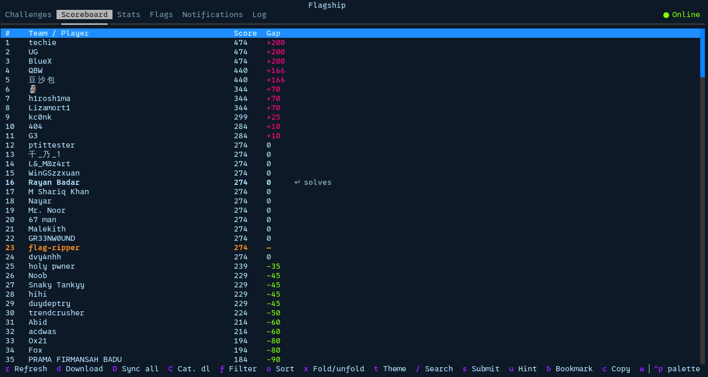
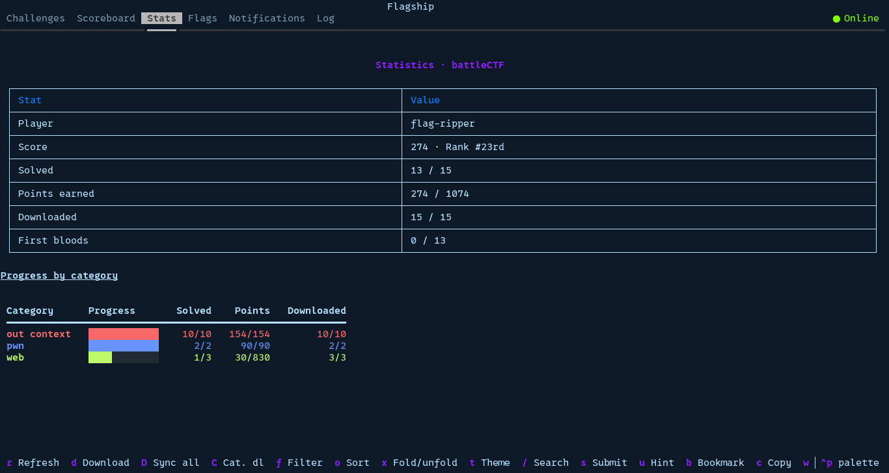
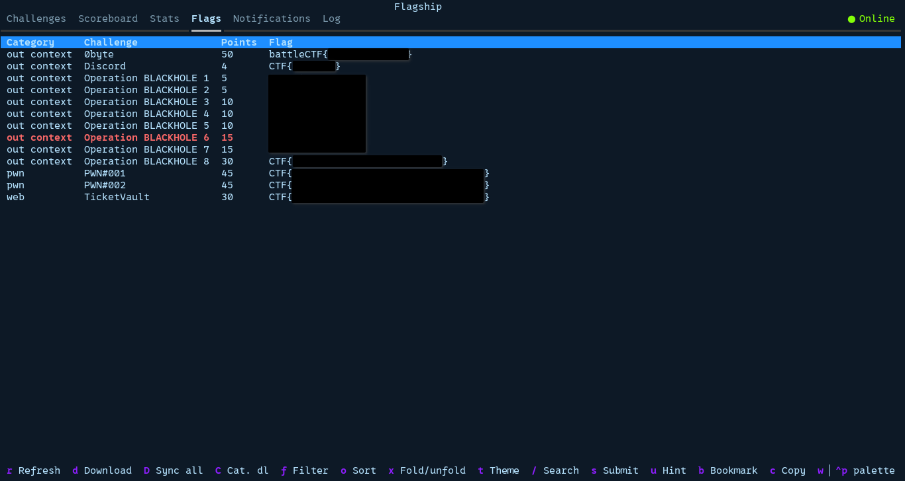

# 🚩 Flagship (Documentation EN)

New CTF, same routine: create folders, download files, track what's solved, keep
per-challenge notes. Flagship does all of it for you.

## Preview


> The interface and the generated files (`desc.txt`, `notes.md`…) are in English.

## Screens

**Scoreboard**



**Stats**



**Flags**



## Features

- Lists challenges
- Downloads challenges: one, a whole category, or all of them
- Tracks what's solved; writes `flag.txt` when a flag is accepted
- Detects description/hint changes (`desc2.txt`, `desc3.txt`…)
- Submits flags
- Remembers rejected flags so they're never resent
- Limited-attempts challenge: a confirmation window before submitting
- Unlocks hints (confirmation for paid ones)
- Search, filter (all / unsolved / solved / bookmarked) and sort
- Bookmarks to pin a challenge
- Per-challenge notes (`notes.md`) in the editor of your choice
- Full scoreboard; double-click a row (or Enter) shows the solve history of a user or team
- "Gap" column: each row's point gap vs you (green = you lead, red = they lead you)
- Stats: score, rank, solved, points, first bloods (per-member in team mode)
- Everything cached locally: browsable offline and after the CTF
- Resizable panes, colour themes, Markdown export
- Six tabs: Challenges, Scoreboard, Stats, Flags, Notifications (platform
  announcements), Log (internal journal)

## Install

```bash
cd /workspace/flagship
pip install -e .            # installs Flagship + deps, adds the `flagship` command
```

## Configure

```bash
cp config.sh.example config.sh
$EDITOR config.sh
```

```sh
URL=https://ctf.example.com          # CTFd URL
CTFD_TOKEN=ctfd_xxxxxxxxxxxxxxxxxxx  # token (CTFd > Settings > Access Tokens)

# optional
CTF_NAME=MyCTF               # displayed name and default folder
BASE_DIR=./                  # root of generated folders (relative to config.sh)
POLL_INTERVAL=60             # auto-sync every N seconds (0 = disabled)
WRITE_FLAG_ON_SOLVE=true     # write flag.txt when a flag is accepted
WATCH_CHANGES=true           # track desc/hint changes (false = lighter sync)
AUTO_UNLOCK_FREE_HINTS=false # auto-unlock free (cost 0) hints
DOWNLOAD_WORKERS=6           # parallel downloads for "Sync all"
THEME=textual-dark           # start theme (`t` to cycle)
EDITOR=nano                  # editor for notes (e.g. vim, subl, code)
```

## Run

```bash
./flagship.sh                 # uses ./config.sh
./flagship.sh path/config.sh
# or: python3 -m flagship [config.sh]
```

One clone handles many CTFs: each CTF gets its own `config.sh` (with its own `BASE_DIR`),
passed as an argument. An alias saves retyping the path:

```bash
alias flagship='~/ctfs/flagship/flagship.sh'
flagship ~/ctfs/HeroCTF/config.sh
```

## Keyboard shortcuts

| Key | Action |
|-----|--------|
| `↑`/`↓`, Enter | navigate, open a challenge |
| click tabs | switch tab |
| `d` / `D` / `C` | download: the challenge / all / the category |
| `/` | search |
| `r` | refresh now |
| `f` / `o` | cycle filter / sort |
| `b` | toggle bookmark |
| `x` | fold/unfold categories |
| `t` | cycle theme |
| `l` | Log tab: toggle last 500 ↔ full history |
| `s` | focus the flag field |
| `u` | unlock a hint |
| `c` / `w` | copy connection / open folder |
| `e` | edit notes (`notes.md`) |
| `p` / `P` | export progress / the Flags tab |
| `A` | cache the whole scoreboard's solve history |
| `Esc` | leave the active field |
| drag `┃` | resize the panes (double-click: reset) |
| `q` | quit |

## Themes


- **Dark (15):** `ansi-dark`, `atom-one-dark`, `catppuccin-frappe`, `catppuccin-macchiato`,
  `catppuccin-mocha`, `dracula`, `flexoki`, `gruvbox`, `monokai`, `nord`, `rose-pine`,
  `rose-pine-moon`, `solarized-dark`, `textual-dark`, `tokyo-night`
- **Light (6):** `ansi-light`, `atom-one-light`, `catppuccin-latte`, `rose-pine-dawn`,
  `solarized-light`, `textual-light`

## Architecture

| File | Role |
|------|------|
| `config.py` | Reads `config.sh` (no shell involved) |
| `ctfd.py` | CTFd API client |
| `store.py` | Folders, `desc.txt`, `flag.txt`, downloads, cache |
| `app.py` | The Textual TUI |
| `__main__.py` | Entry point |

## Downloads

Files go into `work/`. A file larger than **2 GB is not downloaded** automatically (to
avoid filling the disk): it's marked `manual` and its link stays in `desc.txt` for manual
retrieval.

Each challenge gets a `downloads.txt` report where every line carries a status:

| Status   | Meaning                                                              |
| -------- | ------------------------------------------------------------------- |
| `ok`     | file downloaded into `work/`                                        |
| `skip`   | already present, not overwritten                                    |
| `manual` | fetch it by hand (link in `desc.txt`): > 2 GB, private Drive, MEGA… |
| `error`  | the download failed                                                 |

## File tree

Example layout of the generated files:

```
MyCTF/                               # your CTF root (BASE_DIR)
├── config.sh                        # URL + token (never displayed)
├── PROGRESS_flagship.md             # generated progress table (press p)
├── FLAGS_flagship.md                # generated flags export (press P)
├── .flagship/                       # internal cache & state (leave it)
└── CHALLENGES/
    ├── Crypto/
    │   ├── crypto1/
    │   │   ├── desc.txt             # challenge statement
    │   │   ├── work/                # downloaded files
    │   │   ├── notes.md             # your notes (press e)
    │   │   └── flag.txt             # written when the flag is accepted
    │   └── crypto2/
    │       ├── desc.txt
    │       └── work/
    └── Forensics/
        ├── forensics1/
        │   ├── desc.txt
        │   ├── work/
        │   └── flag.txt
        └── forensics2/
            ├── desc.txt
            └── work/
```

`desc.txt` = statement · `work/` = downloaded files · `notes.md` = your notes · `flag.txt` = appears once the flag is accepted.

## Notes

- Solo or team is auto-detected.
- CTF over or offline: Flagship shows the last cached sync.
- Built for CTFd; other platforms aren't supported.
