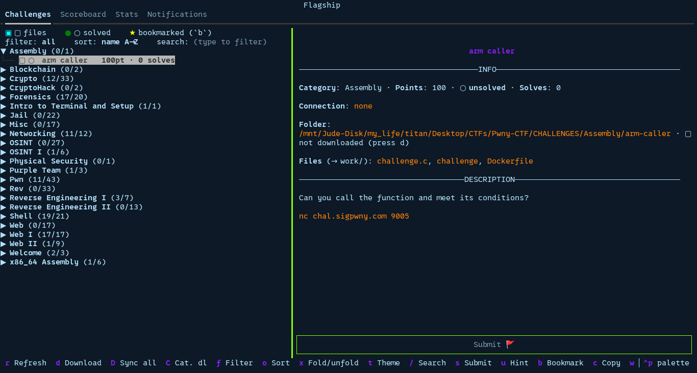

# 🚩 Flagship (Documentation FR)

Nouveau CTF, même routine : dossiers, téléchargements, suivi des résolus, notes à garder.
Flagship s'en charge, toi tu résous les challenges.

Une appli terminal pour CTFd. Liste les challenges, télécharge les fichiers, suit ce qui est
résolu, permet de soumettre des flags. Pas besoin de navigateur.



> L'interface est **en anglais** (libellés, notifications, erreurs), comme les fichiers
> générés (`desc.txt`, `downloads.txt`, `notes.md`, `PROGRESS_flagship.md`).

## Ce que ça fait

- Liste tous les challenges au lancement. Rien ne se télécharge sans qu'on le demande.
- `d` télécharge un challenge, `D` les télécharge tous, `C` une catégorie entière.
- Description ou indices modifiés plus tard ? L'ancien `desc.txt` reste, un nouveau
  `desc2.txt` est créé à côté, avec ce qui a changé.
- Cinq onglets : Challenges, Scoreboard, Stats, Flags, Notifications.
- Recherche (`/`, intégrée à la ligne filtre/tri, ne prend aucune hauteur en plus) : nom,
  catégorie, et la description si elle est déjà en cache. Filtre (`f`) : all, unsolved, solved,
  bookmarked. Tri (`o`, 8 modes : points, solves, nom, id...).
- Favoris (`b`) pour épingler un challenge à reprendre plus tard, marqué `★` dans la liste.
- Soumission de flag depuis le terminal. Un flag déjà tenté et refusé n'est jamais renvoyé.
- Déblocage d'indices à la demande, avec confirmation pour les payants.
- Panneaux redimensionnables : glisser `┃` entre la liste et le détail, double-clic pour
  revenir à la taille par défaut.
- Panneau de détail découpé en INFO / DESCRIPTION / HINT(S), séparateurs centrés.
- Onglet Stats : score, rang, résolus, points, téléchargés, first bloods. En mode équipe,
  détail par membre, clic sur un nom pour voir ses stats, et le panneau de détail indique qui
  dans l'équipe a résolu chaque challenge.
- Clic sur "N solves" pour voir qui a résolu : joueurs en solo, équipes en mode équipe (ta
  propre équipe marquée, avec le membre qui a résolu). CTFd ne révèle jamais quel membre d'une
  autre équipe a résolu, seulement son nom : c'est une limite de la plateforme, pas de Flagship.
- Les challenges à points dynamiques affichent leur plage (initial → minimum). Ceux à essais
  limités affichent combien il t'en reste. Les flags déjà tentés et refusés restent listés,
  pour ne jamais en retaper un par erreur.
- Onglet Flags : tous les challenges résolus (catégorie, challenge, points), avec leur flag
  quand un `flag.txt` en contient un. En mode équipe, le solve d'un coéquipier apparaît comme
  résolu avec un flag `(unknown)` tant que tu n'as pas écrit le flag toi-même dans le dossier
  du challenge. `P` exporte la liste vers `FLAGS_flagship.md`.
- Marche pareil en solo ou en équipe.
- CTF fini ou hors-ligne ? Flagship réaffiche la dernière synchro, rien n'est perdu.

## Installation

```bash
cd /workspace/flagship
pip install -e .            # installe Flagship + dépendances, ajoute la commande `flagship`
# ou : pip install -r requirements.txt
```

> En cas de déplacement du dossier après `pip install -e .`, relancer la commande depuis le
> nouvel emplacement. `./flagship.sh` et `python -m flagship` marchent eux sans réinstaller.

## Configuration

```bash
cp config.sh.example config.sh
$EDITOR config.sh
```

```sh
URL=https://ctf.example.com          # URL du CTFd
CTFD_TOKEN=ctfd_xxxxxxxxxxxxxxxxxxx  # token (CTFd > Settings > Access Tokens)

# optionnel
CTF_NAME=MonCTF            # nom affiché et dossier par défaut
BASE_DIR=./MonCTF          # racine des dossiers générés (relatif au config.sh)
POLL_INTERVAL=60           # synchro auto toutes les N secondes (0 = désactivée)
WRITE_FLAG_ON_SOLVE=true   # écrire flag.txt quand un flag est validé
WATCH_CHANGES=true         # suivre les changements desc/indices ; false = synchro plus légère
AUTO_UNLOCK_FREE_HINTS=false # débloquer automatiquement les indices gratuits
DOWNLOAD_WORKERS=6         # téléchargements en parallèle pour "Sync all"
THEME=textual-dark         # thème de départ (nord, gruvbox, dracula... ; `t` pour cycler)
```

Le nom de la variable token peut aussi être `TOKEN` ou se terminer par `_TOKEN`. `config.sh`
est ignoré par git : ne jamais le partager, il contient le token.

## Lancement

```bash
./flagship.sh                 # utilise ./config.sh
./flagship.sh chemin/config.sh
# ou : python3 -m flagship [config.sh]
```

`flagship.sh` résout le chemin du config en premier, puis se place dans son propre dossier.
Marche depuis n'importe où, avec n'importe quel `config.sh`.

## Un outil, plusieurs CTF

Cloner Flagship une seule fois. Chaque CTF a son propre dossier et son `config.sh`, pointé
via `BASE_DIR`.

```
~/ctfs/
├── flagship/          # cloné une fois
└── HeroCTF/
    └── config.sh      # URL + token + BASE_DIR=.
```

```bash
mkdir ~/ctfs/HeroCTF
cp ~/ctfs/flagship/config.sh.example ~/ctfs/HeroCTF/config.sh
$EDITOR ~/ctfs/HeroCTF/config.sh
~/ctfs/flagship/flagship.sh ~/ctfs/HeroCTF/config.sh
```

Un alias évite de retaper le chemin :

```bash
alias flagship='~/ctfs/flagship/flagship.sh'
flagship ~/ctfs/HeroCTF/config.sh
```

## Raccourcis clavier

| Touche | Action |
|--------|--------|
| `↑`/`↓`, Entrée | naviguer, ouvrir un challenge (énoncé affiché, sans téléchargement) |
| clic sur les onglets | basculer entre Challenges, Scoreboard, Stats, Flags, Notifications |
| `d` | télécharger/mettre à jour le challenge sélectionné |
| `D` | tout synchroniser (parallèle, barre de progression, confirmation) |
| `C` | télécharger la catégorie sous le curseur (confirmation) |
| `/` | focus sur le champ de recherche en ligne, filtre en direct |
| `r` | rafraîchir maintenant (liste, scoreboard, rang) |
| `f` | changer de filtre : all, unsolved, solved, bookmarked |
| `b` | activer/désactiver le favori sur le challenge sélectionné |
| `x` | replier toutes les catégories, ou tout déplier |
| `o` | changer de tri : catégorie, points, solves, moins de solves, nom, id, téléchargés d'abord, non résolus d'abord |
| `t` | changer de thème (mémorisé) |
| `s` | focus sur le champ de flag |
| `u` | débloquer un indice (confirmation) |
| `c` | copier la connexion du challenge |
| `w` | ouvrir le dossier du challenge |
| `e` | éditer les notes (`notes.md`) |
| `p` | exporter vers `PROGRESS_flagship.md` |
| `P` | exporter l'onglet Flags vers `FLAGS_flagship.md` |
| `Échap` | quitter le champ actif ; sur la recherche, l'efface aussi |
| glisser `┃` | redimensionner liste/détail (double-clic : réinitialiser) |
| `Tab` / `Maj+Tab` | déplacer le focus |
| `q` | quitter |

## Architecture

```
flagship/
├── config.py   # lit config.sh, sans passer par un shell
├── ctfd.py     # client de l'API CTFd
├── store.py    # arborescence, desc.txt, flag.txt, téléchargements
├── app.py      # la TUI Textual
└── __main__.py # point d'entrée
```

`ctfd.py` appelle : `GET /challenges`, `/challenges/<id>` (détail + prérequis),
`/users/me` ou `/teams/me` (mode détecté), `/…/solves`, `/scoreboard`,
`/challenges/<id>/solves` (first blood), `POST /challenges/attempt` (soumission),
`POST /unlocks` (indices). Les erreurs s'affichent dans la TUI, elles ne la font jamais
planter.

`store.py` : `slugify()` transforme un nom en nom de dossier. Espaces en `-`, jamais de
tirets doublés, et les caractères spéciaux du shell (`` ' " ` $ ! ; & | ( ) < > { } [ ] * ? ~ # = % ``)
sont supprimés plutôt que remplacés, donc `"Anakin's PC"` devient `Anakins-PC`, pas `Anakin's-PC`.
`list_state()` liste seulement ; `download_one()`, `download_subset()`, `sync()`
téléchargent. Un `.flagship.json` caché par challenge garde la trace des changements, donc
`descN.txt` n'est écrit que si quelque chose a vraiment changé. Les flags incorrects sont
mémorisés dans `.flagship/attempts.json` pour ne jamais être renvoyés.

`app.py` : les appels réseau tournent dans des workers threadés, l'interface reste fluide. Le
détail d'un challenge se charge à la sélection, puis reste en cache.

## Téléchargements

Uniquement à la demande (`d`, `D`, ou `C`). Chaque challenge reçoit un rapport
`downloads.txt` (`ok`/`skip`/`manual`/`error`). Les liens finissent toujours dans `desc.txt`.

| Source | Comportement |
|--------|--------------|
| Fichier hébergé par le CTFd | téléchargé (authentifié), garde-fou 2 Go |
| Lien http(s) direct | téléchargé, token jamais envoyé, garde-fou 2 Go |
| Dropbox | réécrit en lien direct, puis téléchargé |
| Google Drive | via `gdown`, ou `manual` si privé |
| MEGA | via `megatools` si installé, sinon `manual` |
| Plus de 2 Go | pas téléchargé, marqué `manual` |

`d` est auto-réparateur : recrée `desc.txt` s'il manque, complète ce qui manque dans `work/`.
Le token CTFd ne part jamais vers un hôte tiers.

## À noter

- Solo ou équipe est détecté automatiquement. En mode équipe, score/rang/résolus affichés
  sont ceux de **l'équipe**.
- Le statut résolu vient de l'API, ou d'un `flag.txt` local en repli.
- Les indices payants demandent toujours confirmation.
- CTF fini ou API en panne : Flagship réaffiche la dernière synchro en cache plutôt qu'un
  écran vide.
- Conçu pour CTFd. Les autres plateformes ne sont pas prises en charge.
